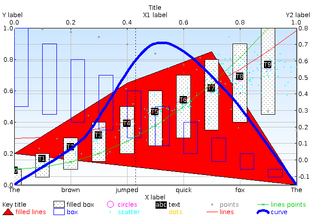
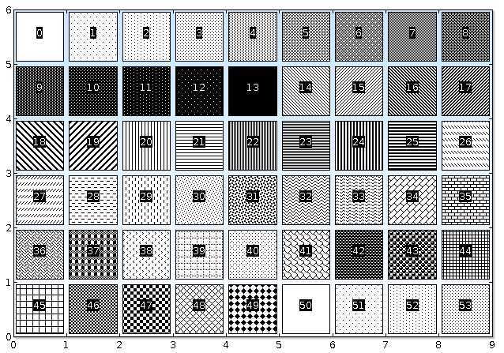

RPlot Instructions
==================

Basically I wrote RPlot to have a look and feel similar to GNUPlot, and to work in a manner such that it can be programatically added to java applications.  As a result many of the API calls bare some resemblance to GNUPlot commands.  I have not written, and do not intend to write, an interactive command line based UI for RPlot.  If you want to use one I recommend that you install GNUPlot.

Have fun.

Richard.

Build
-----

First check you have apache ant and Java 1.7 or later. Then:

    $ ant RPlot.jar

Tests
-----

There are some unit tests, if you are interested in running them then do the following:

    $ ant runalltests

Documentation
-------------

    $ ant javadoc

Then open `build/javadocs/index.html` in your favourite browser.

Demo
----

To see a demo graph showing several of the plot types available in a Swing dialog run:

    $ java -jar build/RPlot.jar

You should see a window appear containing the following plot:

Right click on the graph produces a popup menu allowing you to print, save as an image.  Left click and drag a region to zoom in.

To see some pretty black and white textures run:

    $ java -jar build/RPlot.jar textures

You should see a window appear containing the following plot:

The code for both of these is in [SwingPlot.java](src/com/reeltwo/plot/demo/SwingPlot.java). The method `genTest` shows you how to set up a graph object.  Once the graph object has been setup its just a matter of giving it to a `PlotPanel` to render.

Examples
--------

Here's a very simple example of a line graph.

    Point2D [] points = new Point2D[3];
    points[0] = new Point2D(1.0f, 1.0f);
    points[1] = new Point2D(3.0f, 2.1f);
    points[2] = new Point2D(5.0f, 1.5f);

    PointPlot2D plot = new PointPlot2D();
    plot.setData(points);
    plot.setLines(true);
    plot.setPoints(true);

    Graph2D graph = new Graph2D();
    graph.addPlot(plot);

    plotPanel.setGraph(graph);  // assume plot panel is created elsewhere

